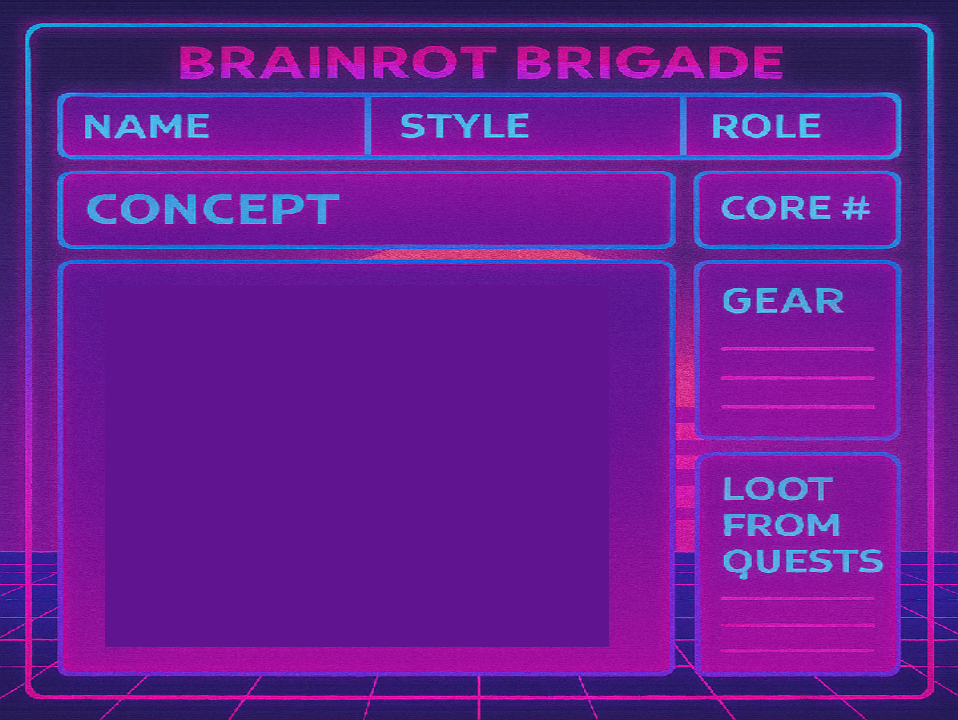

## What you will make

Build a digital character sheet for **Brainrot Brigade**, a collaborative sci-fi roleplaying game. You will create heroes, customise a layered avatar with parts won from quests, choose gear, roll the right number of dice, and celebrate special Laser Focus results.

> [!NOPRINT]
>
> 

>  <iframe allowtransparency="true" width="485" height="402" src="https://scratch.mit.edu/projects/embed/1195868627/?autostart=false" frameborder="0"></iframe>
> 

Click the avatar, then try the **RANDOM**, **DICEROLL**, **P**, **E**, and **T** buttons.

> [!PRINTONLY]
>
> 

### You will need:

- The [Brainrot Brigade starter project](resources/bb-character-sheet-starter.sb3)
- The [Brainrot Brigade loadout list](resources/Brainrot%20Brigade%20Loadout%20Lists.xlsx)
- Scratch 3, online or installed on your computer
