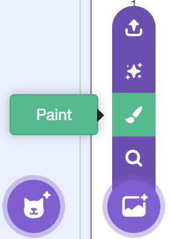

## Customise your character sheet

Add your own visual theme, organise the controls, and test the whole digital character sheet.

> [!TASK]
>
> Give your project a name, such as `Brainrot Brigade character sheet`.
>
> 

> [!TASK]
>
> Hover over **Choose a Backdrop** and click **Paint** to make a new backdrop.
>
> 

> [!TASK]
>
> Design a character-sheet theme of your own. Keep clear spaces for the visible name, style, role, concept, core-number, and gear readouts.
>
> You could use neon sci-fi colours like the example, a ship's computer screen, an alien notebook, or a theme inspired by your character.

> [!TASK]
>
> Add at least one more backdrop so the player has a choice of themes. You can paint it, choose one from the library, or upload artwork you have permission to use.

> [!TASK]
>
> Select the `Stage` and start a new script with a `when b key pressed`{:class="block3events"} block.
>
> ```blocks3
> when [b v] key pressed
> ```

> [!TASK]
>
> Add `next backdrop`{:class="block3looks"} to the script.
>
> ```blocks3
> when [b v] key pressed
> +next backdrop
> ```

Press B several times. The Stage should cycle through every character-sheet theme.

> [!TASK]
>
> Drag the visible variable and list readouts into the spaces on your backdrop. Keep the RANDOM and DICEROLL buttons, the P/E/T switches, and every readout clear and clickable.

> [!TASK]
>
> Test random character creation: click **RANDOM**, answer `Y`, and check that all six character fields change while the gear list stays in place.

> [!TASK]
>
> Test custom character creation: press space, answer `Y`, enter your own details, and try one invalid core number before entering a value from 2 to 5.

> [!TASK]
>
> Test the dice roller with P, E, and T off, then with different combinations switched on. Check that only the selected bonus dice appear and that the four-number summary uses `0` for dice that were not rolled.

> [!TASK]
>
> Save the project to your computer from the **File** menu.
>
> 

Your finished character sheet should now create heroes, remember their loadout, roll the correct bonus dice, show every result, celebrate Laser Focus, and switch between your backdrop themes.
