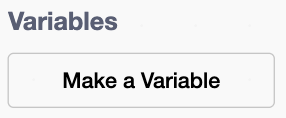

## Set up your character sheet

Set up the information your digital character sheet needs to remember and display.

> [!TASK]
>
> Download and open the [Brainrot Brigade starter project](resources/bb-character-sheet-starter.sb3).
>
> In Scratch online, choose **File** then **Load from your computer**. In the Scratch app, choose **File** then **Load from your computer**.
>
> 

> [!TASK]
>
> Select the `Stage`. Open `Variables`{:class="block3variables"} and tick the `style`{:class="block3variables"}, `role`{:class="block3variables"}, `name`{:class="block3variables"}, `name2`{:class="block3variables"}, and `concept`{:class="block3variables"} lists one at a time.
>
> These lists are already filled with character ideas. Untick them when you have finished exploring so they do not cover the character sheet.

> [!INFO]
>
> A **list** stores several related items. Later, your code will pick a random item from each idea list.

> [!TASK]
>
> Make a variable called `name`{:class="block3variables"} **for all sprites**. Keep its checkbox ticked so the character's first name appears on the Stage.
>
> 
>
> 

> [!TASK]
>
> Make a variable called `name2`{:class="block3variables"} **for all sprites**. Keep it visible for the character's second name.

> [!TASK]
>
> Make a variable called `style`{:class="block3variables"} **for all sprites**. Keep it visible.

> [!TASK]
>
> Make a variable called `role`{:class="block3variables"} **for all sprites**. Keep it visible.

> [!TIP]
>
> A character's **style** describes their personality, while their **role** describes their speciality aboard the ship.

> [!TASK]
>
> Make a variable called `concept`{:class="block3variables"} **for all sprites**. Keep it visible for a short sentence about the character.

> [!TASK]
>
> Make a variable called `core#`{:class="block3variables"} **for all sprites**. Keep it visible.

> [!INFO]
>
> A core number is from 2 to 5. A higher number favours careful Logic actions; a lower number favours creative or people-focused Instinct actions.

> [!TASK]
>
> Make a list called `gear`{:class="block3variables"} **for all sprites**. Keep the list visible.

> [!TASK]
>
> Open the [Brainrot Brigade loadout list](resources/Brainrot%20Brigade%20Loadout%20Lists.xlsx). Choose one gear profile, or mix and match, then add three starting items to `gear`{:class="block3variables"}.
>
> The rules allow no more than one item marked **permanent** in a starting loadout.

> [!TASK]
>
> Drag the visible readouts over their matching spaces on the character sheet. Put the two name readouts beside each other.

Check the Stage. It should now have empty character fields ready to fill, plus a visible list of three useful gear items.
