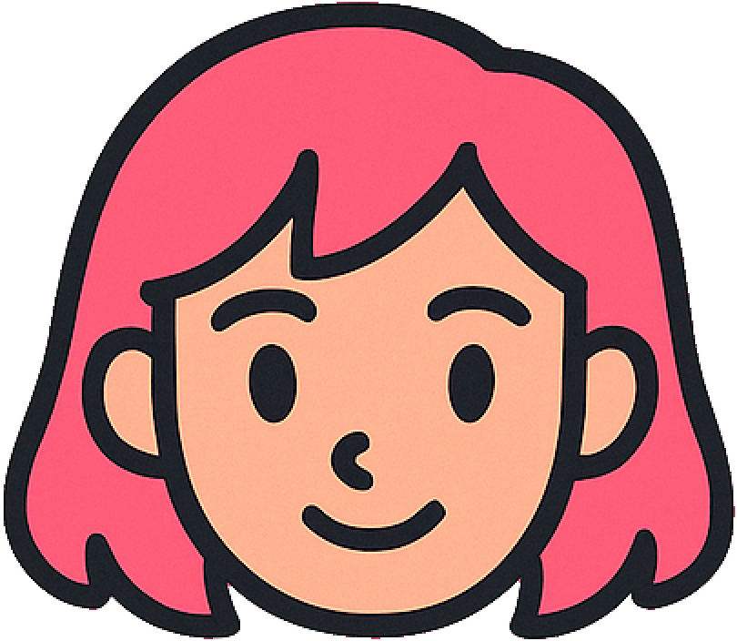
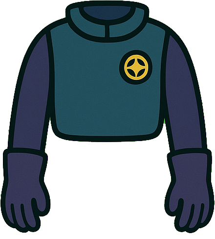
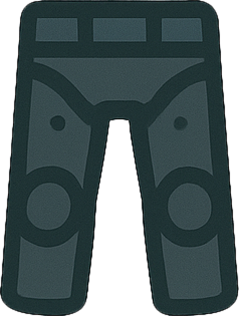
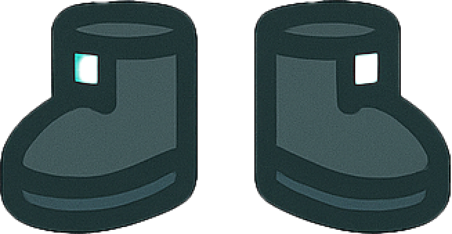

## Build your identikit avatar

Make the layered character portrait respond to clicks and change when a new random character is created. New identikit parts can be won by completing Brainrot Brigade quests.

> [!TASK]
>
> Select the `head` sprite and open the **Costumes** tab. Look through the different heads already in the starter project.
>
> <p align="center">
> 
> 
> 
> 
> </p>

> [!INFO]
>
> The portrait is split into `head`, `body`, `legs`, and `feet` sprites. These identikit layers let players replace one part without redrawing the whole character. When players complete quests, they can win new parts and add them as costumes to the matching sprite.

> [!TASK]
>
> Start a new script on `head` with a `when this sprite clicked`{:class="block3events"} block.
>
> ```blocks3
> when this sprite clicked
> ```

> [!TASK]
>
> Add `next costume`{:class="block3looks"} so a click moves to the next head.
>
> ```blocks3
> when this sprite clicked
> +next costume
> ```

Click the avatar's head on the Stage. It should change to a new face or hairstyle each time.

> [!TASK]
>
> Start a second script on `head` with a `when I receive random`{:class="block3events"} block. Create the new `random` message when Scratch asks.
>
> ```blocks3
> when I receive (random v)
> ```

> [!TASK]
>
> Switch to a random costume number from 1 to 20 when the message arrives.
>
> ```blocks3
> when I receive (random v)
> +switch costume to (pick random (1) to (20))
> ```

> [!TIP]
>
> The range leaves space for head costumes unlocked in later adventures. Scratch cycles around if the chosen number is higher than the number of costumes currently available.

> [!TASK]
>
> Return to the `random` sprite. At the end of its `if`{:class="block3control"} block, broadcast the `random` message after setting `core#`{:class="block3variables"}.
>
> ```blocks3
> set [concept v] to (item (pick random (1) to (length of [concept v])) of [concept v])
> set [core# v] to (pick random (2) to (5))
> +broadcast (random v)
> ```

Click **RANDOM** and answer `Y`. The character details and avatar head should all change together.

> [!TASK]
>
> Select the `body` sprite. Start a new script with a `when this sprite clicked`{:class="block3events"} block.
>
> ```blocks3
> when this sprite clicked
> ```

> [!TASK]
>
> Add `next costume`{:class="block3looks"} beneath it.
>
> ```blocks3
> when this sprite clicked
> +next costume
> ```

> [!TASK]
>
> Drag the completed body script onto the `legs` sprite in the sprite list.

> [!TASK]
>
> Drag the same body script onto the `feet` sprite.

> [!TASK]
>
> Drag the `when I receive random`{:class="block3events"} script from `head` onto the `body` sprite. Keep its random costume range from 1 to 20.

> [!TASK]
>
> Drag the same randomise script from `head` onto the `legs` sprite.

> [!TASK]
>
> Drag the randomise script from `head` onto the `feet` sprite.

> [!INFO]
>
> Body, legs, and feet begin with one costume, so their clicks and random choices will not look different yet. Their click and broadcast scripts are ready for quest rewards: add a newly won identikit part as a costume and it immediately joins both ways of changing the avatar.

Click the head to choose a look, then click **RANDOM** again. All four avatar layers should receive the `random` message. For now, the layered avatar stays aligned while its head changes; newly won costumes will let its body, legs, and feet change too.
