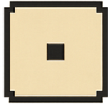

## Roll your first die

Animate a six-sided die and detect the special result that matches the character's core number.

> [!TASK]
>
> Make a variable called `roll`{:class="block3variables"} **for all sprites**. Untick its checkbox so the result only appears through the die animation.

> [!TASK]
>
> Select the `dice roller` sprite. Start its click script with a `when this sprite clicked`{:class="block3events"} block.
>
> <p align="center"></p>
>
> ```blocks3
> when this sprite clicked
> ```

> [!TASK]
>
> Reset `roll`{:class="block3variables"} to `0` at the start of the script.
>
> ```blocks3
> when this sprite clicked
> +set [roll v] to (0)
> ```

> [!TASK]
>
> Make a new message called `roll`, then broadcast it after the reset.
>
> ```blocks3
> when this sprite clicked
> set [roll v] to (0)
> +broadcast (roll v)
> ```

> [!INFO]
>
> A broadcast sends one message to several sprites at once. The button controls the roll without needing to contain every die's animation.

> [!TASK]
>
> Select the `die` sprite. Start a new script with a `when I receive roll`{:class="block3events"} block.
>
> <p align="center"></p>
>
> ```blocks3
> when I receive (roll v)
> ```

> [!TASK]
>
> Bring the die to the front layer and show it.
>
> ```blocks3
> when I receive (roll v)
> +go to [front v] layer
> +show
> ```

> [!TASK]
>
> Add a `repeat`{:class="block3control"} loop that quickly changes the die to ten random costumes.
>
> ```blocks3
> when I receive (roll v)
> go to [front v] layer
> show
> +repeat (10)
> switch costume to (pick random (1) to (6))
> wait (0.1) seconds
> end
> ```

Click **DICEROLL**. The die should flick through random faces, then stop.

> [!TASK]
>
> After the loop, store the final costume number in `roll`{:class="block3variables"}.
>
> ```blocks3
> repeat (10)
> switch costume to (pick random (1) to (6))
> wait (0.1) seconds
> end
> +set [roll v] to (costume [number v])
> ```

> [!TASK]
>
> Add an `if else`{:class="block3control"} block that checks whether `roll`{:class="block3variables"} equals `core#`{:class="block3variables"}. In the matching branch, play the `Win` sound until it finishes.
>
> ```blocks3
> set [roll v] to (costume [number v])
> +if <(roll) = (core#)> then
> play sound (Win v) until done
> else
> end
> ```

> [!TASK]
>
> In the matching branch, make a new message called `laser focus` and broadcast it after the sound.
>
> ```blocks3
> if <(roll) = (core#)> then
> play sound (Win v) until done
> +broadcast (laser focus v)
> else
> end
> ```

> [!TASK]
>
> Still in the matching branch, say the costume number for 5 seconds and then hide the die.
>
> ```blocks3
> if <(roll) = (core#)> then
> play sound (Win v) until done
> broadcast (laser focus v)
> +say (costume [number v]) for (5) seconds
> +hide
> else
> end
> ```

> [!TASK]
>
> Fill the `else`{:class="block3control"} branch with the same speech and hide blocks, but without the sound or broadcast.
>
> ```blocks3
> if <(roll) = (core#)> then
> play sound (Win v) until done
> broadcast (laser focus v)
> say (costume [number v]) for (5) seconds
> hide
> else
> +say (costume [number v]) for (5) seconds
> +hide
> end
> ```

> [!INFO]
>
> Rolling exactly the core number triggers **Laser Focus**. In the roleplaying game, this gives the character a sudden insight or a free question for the game master.

> [!TASK]
>
> Start a second script on the `die` sprite with another `when I receive roll`{:class="block3events"} block.
>
> ```blocks3
> when I receive (roll v)
> ```

> [!TASK]
>
> Make the die bounce if it is on the edge, then send it to a random position.
>
> ```blocks3
> when I receive (roll v)
> +if on edge, bounce
> +go to (random position v)
> ```

> [!TASK]
>
> Glide to one more random position over 1 second.
>
> ```blocks3
> when I receive (roll v)
> if on edge, bounce
> go to (random position v)
> +glide (1) secs to (random position v)
> ```

Click **DICEROLL** several times. The die should move, animate, show a number, and disappear. A result equal to the core number should also play the Win sound.
